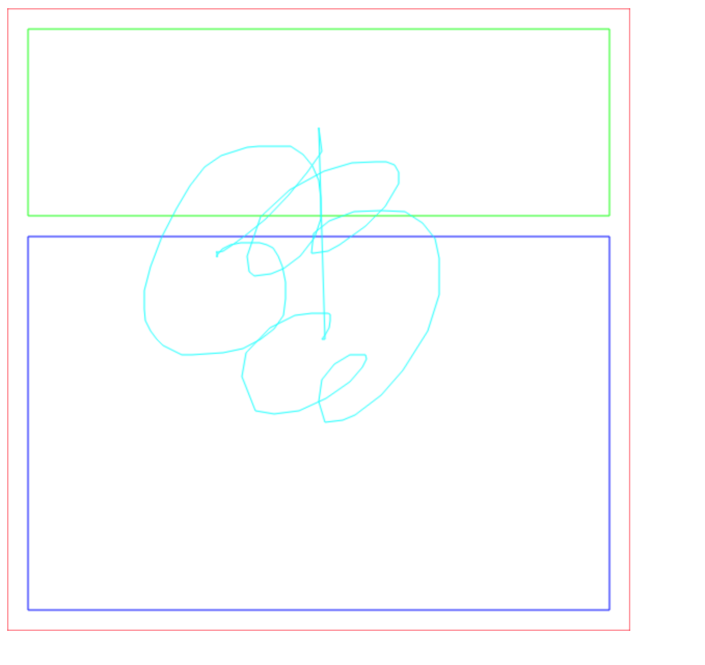

# 一个简单的 2D 图像合成系统，集成了yoga-layout

包含如下基础部分：

* `GraphicsPrimitive`: 用来描述基础几何元素，如直线、折线、三角形、贝塞尔曲线等
* `DisplayObject`: 一个用来描述实际内容的树状结构，基本的信息包含节点的 layout 信息和子节点数组，他包含一个 draw 方法，将内容转化为`GraphicsPrimitive`数组
* `Compositor`：平台相关的像素化器，将`GraphicsPrimitive`转化为图片数据`ImageData`，工程里只实现了`CanvasCompositor`来演示基本流程

具体流程见`draw.ts`，`demo.ts`里用到的示例代码·如下：

```typescript
import CanvasCompositor from './compositors/canvas';
import { Polyline } from './displayObjects/Polyline';
import draw from './draw';
import { Rectangle } from './displayObjects/Rectangle';
import Yoga from 'yoga-layout';

export default function demo() {
  const compositor = new CanvasCompositor();
  const size = 600;
  compositor.setSize(size, size);
  const r1 = new Rectangle({
    color: 0xff0000
  });
  r1.layout.setPadding(Yoga.EDGE_ALL, 10);
  r1.layout.setPosition(Yoga.EDGE_LEFT, 0);
  r1.layout.setPosition(Yoga.EDGE_TOP, 0);
  r1.layout.setWidth(size);
  r1.layout.setHeight(size);
  r1.layout.setDisplay(Yoga.DISPLAY_FLEX);
  const r2 = new Rectangle({
    color: 0x00ff00
  });
  r2.layout.setFlex(1);
  r2.layout.setMargin(Yoga.EDGE_ALL, 10);

  const r3 = new Rectangle({
    color: 0x0000ff
  });
  r3.layout.setFlex(2);
  r3.layout.setMargin(Yoga.EDGE_ALL, 10);

  r1.append(r2);
  r1.append(r3);

  const imageData = draw(r1, compositor);
  const canvas = document.createElement('canvas');
  canvas.width = size;
  canvas.height = size;
  const ctx = canvas.getContext('2d')!;
  ctx.putImageData(imageData, 0, 0);
  document.body.appendChild(canvas);
  
  const line = new Polyline({color: 0x00ffff});
  line.layout.setPositionType(Yoga.POSITION_TYPE_ABSOLUTE);
  line.layout.setPosition(Yoga.EDGE_LEFT, 0);
  line.layout.setPosition(Yoga.EDGE_TOP, 0);
  r1.append(line);

  document.body.onmousemove = e => {
    const dot = {
      x: e.pageX,
      y: e.pageY
    };
    line.points.push(dot);
    ctx.putImageData(draw(r1, compositor), 0, 0);
  };
}
```

## 运行

yarn && yarn start

## 截图


